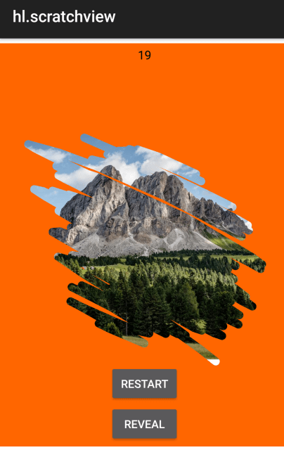

# Hyperloop Scratch View

Axway Hyperloop example of an Android scratch view



Library: <https://github.com/D-clock/ScratchView> (modified)

```javascript
var scratchview = require("/scratchview");
scratchview.setEraserSize(30);
scratchview.setMaxPercent(50);
scratchview.onProgress(function(percent){
	console.log(percent);
})
scratchview.onCompleted(function(){
	console.log("done");
})
```
